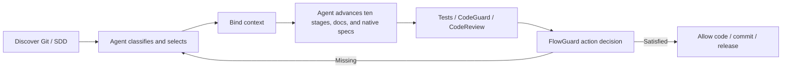

# FlowGuard · Agent-Driven SDD Governance

[](https://github.com/full-stack-plugins/flowguard-plugin/actions/workflows/skills-check.yml)
[](LICENSE)

FlowGuard is an agent governance plugin for Codex, ZCode, Kimi, and Claude. **Its ten-stage process remains mandatory and agent-driven; native SDD tools own specifications and engineering methods; FlowGuard validates stage documents in `docs/`, approvals, dependencies, and evidence.**

## Responsibilities

- Spec Kit / OpenSpec own the native specification source of truth.
- Superpowers provides execution methods such as clarification, planning, TDD, debugging, review, and verification.
- FlowGuard discovers repository state, binds `session + worktree + task/change`, validates dependencies and evidence, and gates code writes, commits, and releases.
- CodeGuard produces deterministic test, static-analysis, build, dependency, and credential evidence.
- CodeReview produces semantic-review evidence grounded in the selected specification and code context.

FlowGuard does not copy specifications, silently initialize tools, or turn a machine PASS into user acceptance.

## Governance loop



The ten stages are a verifiable process skeleton, not a Hook-driven script. Read-only tasks only need discovery and classification; writing tasks must satisfy applicable stage gates.

| Task type | Default governance |
|:---|:---|
| Read-only analysis | Discover and classify; no initialization required |
| Simple change | Bind context; reuse or justify skipped stages; retain verification evidence |
| Important change | Bind a native specification, complete ten-stage documents and approval, execute with TDD |
| Production incident | Restore stability first; backfill behavior-changing specifications |

## Quick start

```bash
/flowguard-discover    # read-only; never installs or initializes tools
/flowguard-context     # classify and bind this session/worktree/task
/flowguard-init        # create project-level stage docs 02/07/10
/flowguard-stage       # read and advance docs/ stage documents
/flowguard-evidence    # record real verification evidence
/flowguard-governance  # check code-write, commit, or release readiness
```

The CLI additionally provides `validate` (artifact content, traceability matrix and module-stack coverage checks).

Kimi registers the same command prompts as namespaced Markdown commands, for example `/flowguard:flowguard-discover`. The Markdown files in `kimi-commands/` are generated from `commands/*.json`; regenerate with `python3 scripts/generate_kimi_commands.py --write` after changing a source command. Kimi Shell may not expose `KIMI_PLUGIN_ROOT`; in that case, use `/plugins info flowguard` to locate the enabled plugin before running its bundled CLI. The plugin remains centrally cataloged in `full-stack-plugins`; this source repository is maintained separately.

CLI example:

```bash
python3 scripts/flowguard_state.py discover --json
python3 scripts/flowguard_state.py context bind \
  --session session-1 --task-id refund-idempotency \
  --task-type important_change --spec-system openspec \
  --spec-ref openspec/changes/refund-idempotency --json
python3 scripts/flowguard_state.py stage status --task-id refund-idempotency --json
python3 scripts/flowguard_state.py governance \
  --session session-1 --action code_write --json
```

## Action gates

| Action | Minimum condition |
|:---|:---|
| Read / specification remediation | Always open so a block can be resolved |
| Test write | Active governance context |
| Business-code write | Stages 01–07 satisfied; important changes also need a valid spec and scope approval |
| `git commit` | Stages 01–09 plus valid current-fingerprint tests, static analysis, and semantic review |
| Release | All ten stages, valid stage-09 documents for every feature listed in the stage-10 release scope, release readiness, user acceptance, and completed dependencies/children |

Denials use exit code 2 and return `code / message / fix / missing / allowed_actions`. Hook failures fail open; known governance gaps fail closed.

## Hooks

- `SessionStart`: discover SDD state and restore context.
- `UserPromptSubmit`: remind the agent to reassess task, scope, and source of truth.
- `PreToolUse`: gate code writes, Git commits, and releases; protect governance state.
- `PostToolUse`: expire stale evidence and observe explicit test exit codes; CodeGuard/CodeReview PASS requires a structured, verifiable result rather than a zero exit code alone.
- Kimi `PostToolUseFailure` for Shell: mark a recognized failed test run as FAIL so an earlier PASS cannot remain current.
- `Stop`: summarize missing evidence and the next action without treating the turn as task completion.

See [hooks/__protocol__.md](hooks/__protocol__.md).

## Document locations

Project stages 02/07/10 live in `docs/project/`; feature stages 01/03/04/05/06/08/09 live in `docs/features/<task-id>/`. Session cache lives outside the repository in the host state directory. The legacy `.flowguard/` layout and its migration commands were removed in v0.4.0; `docs/legacy-flowguard/` in this repository is a read-only historical archive.

## Documentation

- [Current architecture](docs/FlowGuard-Architecture.zh_CN.md)
- [Ten-stage docs governance specification](docs/superpowers/specs/2026-09-23-flowguard-docs-ten-stage-governance.md)
- [Implementation plan](docs/superpowers/plans/2026-09-23-flowguard-agent-driven-sdd-governance.md)
- [Artifact contract](docs/FLOWGUARD_ARTIFACT_SPEC.md)
- [Roadmap](docs/roadmap.md)

## Verification

```bash
python3 -m unittest discover -s tests -v
python3 scripts/vendor/skill_vendor.py check --offline
python3 scripts/generate_skills.py
python3 scripts/generate_kimi_commands.py
git diff --check
```

Python standard library only. Apache-2.0; see [THIRD-PARTY-NOTICES.md](THIRD-PARTY-NOTICES.md) for implementation references.
