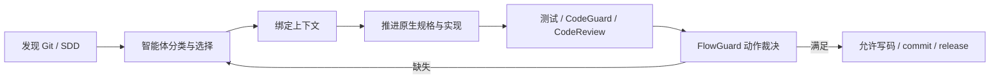

# FlowGuard · 智能体 SDD 治理门禁

[](https://github.com/full-stack-plugins/flowguard-plugin/actions/workflows/skills-check.yml)
[](LICENSE)

FlowGuard 是面向 Codex、ZCode、Kimi 与 Claude 的智能体研发治理插件：**智能体决定怎样推进任务，原生 SDD 工具提供规格与方法，FlowGuard 用可核验的上下文、批准、依赖和证据防止跳过必要步骤。**

## 核心定位

- Spec Kit / OpenSpec：规格事实源，正式正文留在原生目录。
- Superpowers：需求澄清、计划、TDD、调试、审查和完成前验证方法。
- FlowGuard：发现项目现状，绑定 `会话 + worktree + 任务/变更`，校验父子依赖和证据，拦截不合规写码、提交与发布。
- CodeGuard：提供测试、静态分析、构建、依赖和凭据检查证据。
- CodeReview：提供结合规格和代码上下文的语义审查证据。

FlowGuard 不复制规格、不自动初始化工具，也不把机器 PASS 变成用户验收。

## 工作方式



强制的是“遵循适用流程”，不是让所有任务走固定阶段：

| 任务 | 默认治理 |
|:---|:---|
| 只读分析 | 完成发现和分类，不要求初始化 |
| 简单修改 | 轻量上下文 + 当前代码指纹的验证证据 |
| 重要变更 | 绑定原生规格、取得必要批准、按 TDD 推进 |
| 生产故障 | 允许先恢复稳定，行为变化随后补规格 |

## 快速开始

```bash
# 1. 只读发现：不会安装或初始化任何工具
/flowguard-discover

# 2. 智能体分类后绑定本次任务
/flowguard-context

# 3. 实施过程中记录真实证据
/flowguard-evidence

# 4. 写码、提交或发布前复核
/flowguard-governance
```

对应 CLI：

```bash
python3 scripts/flowguard_state.py discover --json
python3 scripts/flowguard_state.py context bind \
  --session session-1 --task-id refund-idempotency \
  --task-type important_change --spec-system openspec \
  --spec-ref openspec/changes/refund-idempotency --json
python3 scripts/flowguard_state.py governance \
  --session session-1 --action code_write --json
```

## 动作门禁

| 动作 | 最低条件 |
|:---|:---|
| 读取 / 补规格 | 保持开放，确保能解除阻断 |
| 补测试 | 已绑定治理上下文 |
| 写业务代码 | 可写任务；重要变更另需有效规格与范围批准 |
| `git commit` | 当前指纹的测试、静态分析、语义审查证据 |
| 发布 | 提交条件 + 发布就绪 + 用户验收 + 依赖/子任务收敛 |

拒绝使用 exit 2，并返回 `code / message / fix / missing / allowed_actions`。Hook 故障本身 fail-open；确定性治理缺口 fail-closed。

## 五类 Hooks

- `SessionStart`：只读发现项目和 SDD 状态，恢复上下文。
- `UserPromptSubmit`：提醒智能体重新判断任务、范围与事实源。
- `PreToolUse`：校验写码、Git commit、发布，并保护治理状态。
- `PostToolUse`：使旧证据过期；仅在明确 exit code 时观察测试/检查结果。
- `Stop`：汇总缺失证据和下一步，不把本轮结束当成任务完成。

协议见 [hooks/__protocol__.md](hooks/__protocol__.md)。

## 兼容旧十阶段

v0.1 的 `.flowguard/project.json`、十阶段产物和 `init/feature/next/advance/override` 命令暂时保留。它们只用于已有项目兼容；新任务不再默认生成十份 `.flowguard` 规格，也不再使用全局 `current_feature` 作为唯一上下文。

## 文档

- [FlowGuard-Architecture.zh_CN.md](docs/FlowGuard-Architecture.zh_CN.md) — 当前架构、运行流、可信边界和风险
- [智能体驱动 SDD 治理规格](docs/superpowers/specs/2026-09-23-flowguard-agent-driven-sdd-governance.md)
- [实施计划](docs/superpowers/plans/2026-09-23-flowguard-agent-driven-sdd-governance.md)
- [旧产物兼容契约](docs/FLOWGUARD_ARTIFACT_SPEC.md)
- [路线图](docs/roadmap.md)

## 验证

```bash
python3 -m unittest discover -s tests -v
python3 scripts/vendor/skill_vendor.py check --offline
python3 scripts/generate_skills.py
git diff --check
```

Python 仅使用标准库。许可证为 Apache-2.0；第三方参照见 [THIRD-PARTY-NOTICES.md](THIRD-PARTY-NOTICES.md)。
