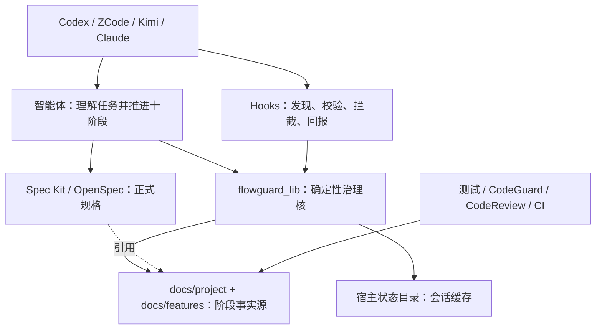
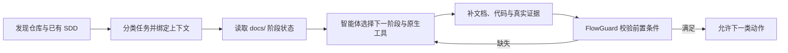

# FlowGuard 架构

> **文档说明**：智能体驱动、`docs/` 承载产物的十阶段流程治理架构。
> **版本**：v3.0
> **最后更新**：2026-09-23

## 1. 文档信息

### 1.1 版本记录

| 版本 | 日期 | 变更内容 | 状态 |
|:---|:---|:---|:---|
| v1.0 | 2026-09-22 | 固定十阶段及项目内状态 | ⏳ 历史 |
| v2.0 | 2026-09-23 | 智能体驱动原生 SDD 治理 | ⏳ 已被修正 |
| v3.0 | 2026-09-23 | 保留强制十阶段，阶段文档迁至 `docs/` | 🔧 实施中 |

### 1.2 责任边界

| 角色 | 负责 | 不负责 |
|:---|:---|:---|
| 智能体 | 理解任务、选择规格事实源、拆分子功能、推进阶段 | 自行伪造用户批准 |
| Spec Kit / OpenSpec | 正式规格及其原生状态 | FlowGuard 门禁 |
| Superpowers | 澄清、TDD、调试、审查与验证方法 | 创建冲突的第二份正式规格 |
| FlowGuard | 十阶段文档、依赖、证据和动作裁决 | 代替模型理解业务、代替用户验收 |
| CodeGuard / CodeReview | 确定性检查与语义审查报告 | 单独裁决提交或发布 |

## 2. 架构与数据所有权

十阶段文档只写 `docs/`。项目级 02 架构、07 规范、10 发布位于 `docs/project/`；功能级 01 需求、03 方案、04 用例、05 概要设计、06 详细设计、08 审查、09 文档位于 `docs/features/<task-id>/`。独立子功能有自己的功能级文档，通过父任务引用继承项目级约束。普通实现步骤仍留在原生 tasks 中。

`context.py` 将会话选择、worktree 和任务关系缓存于宿主状态目录；项目可用 Git、`docs/` 和原生规格重建流程事实。`stage_docs.py` 解析阶段状态和验收指纹，`evidence.py` 在阶段文档中登记检查结果，`governance.py` 提供唯一动作裁决；Hooks 与 CLI 仅为适配层。

## 3. 智能体执行循环

读取、澄清、补规格、补测试始终是解除阻断的路径。写业务代码要求 01—07 阶段满足；提交还要求 08—09 及当前代码的测试、静态分析、语义审查证据；发布还要求 10、发布就绪、用户验收与必要子任务完成。重要变更另须有效原生规格引用和明确范围批准。阶段正文变化使该阶段原验收失效；证据出现更新的失败或代码指纹变化时不得沿用旧 PASS。

## 4. 兼容与历史

`.flowguard/` 兼容/迁移线已随 v0.4.0（2026-09-23）下线：不再提供 `migrate`/`legacy-init`，旧状态机命令与旧 gate 解锁矩阵一并移除。本仓 `docs/legacy-flowguard/` 仅是迁移前状态的只读历史归档，不是事实源，也不构成迁移承诺。新项目的 `init` 只创建 `docs/project/`。

## 5. 可信边界与当前限制

- 宿主若不能提供不可伪造的用户确认回执，CLI 中的 `actor` 或 `approval_ref` 字符串不能证明真实用户验收。
- 通用 Shell 间接写文件可能绕过仅按工具路径识别的 Hook；仓库级 Git Hook、CI 和分支保护应作为提交/合并的独立门禁。
- 不同宿主的 Hook 载入、阻断退出码和安装后的真实触发须分别验证；单元测试与 manifest 校验不能代替运行时验收。
- 检查生产者的 PASS 只能证明相应检查结果，不自动证明需求满足或用户验收。

当前风险清单与验收条件见 [十阶段治理规格](superpowers/specs/2026-09-23-flowguard-docs-ten-stage-governance.md)。

---

**文档版本**：v3.0
**创建日期**：2026-09-23
**最后更新**：2026-09-23
**文档状态**：🔧 实施中
