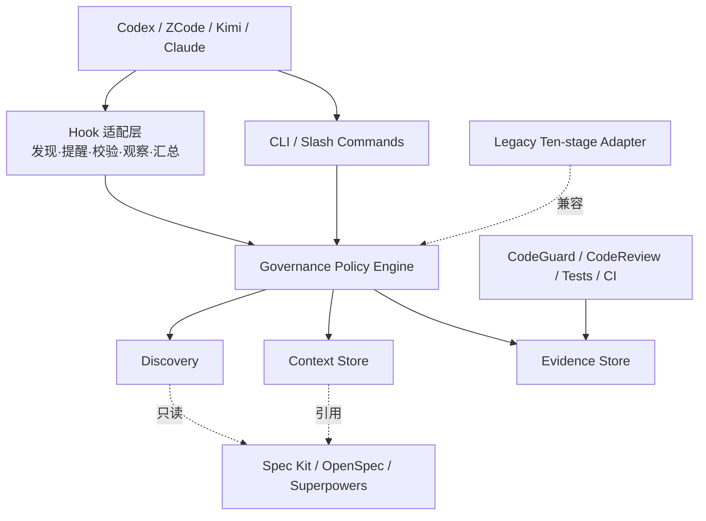
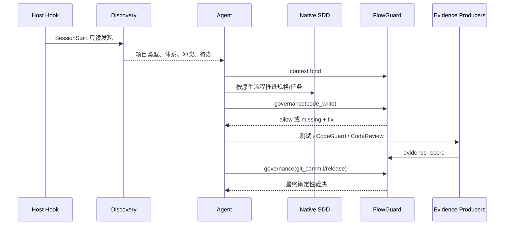
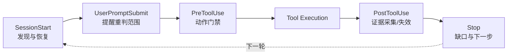

# FlowGuard Architecture

> **文档说明**：FlowGuard 智能体驱动 SDD 治理插件的组件、状态、运行流、门禁和兼容架构。
> **版本**：v2.0
> **最后更新**：2026-09-23

## 1. 文档信息

### 1.1 版本记录

| 版本 | 日期 | 变更内容 | 状态 |
|:---|:---|:---|:---|
| v1.0 | 2026-09-22 | 固定十阶段 SDLC 编排 | ⏳ 兼容保留 |
| v2.0 | 2026-09-23 | 智能体驱动原生 SDD + 确定性治理 | ✅ 当前架构 |

### 1.2 责任边界

| 角色 | 负责 | 不负责 |
|:---|:---|:---|
| 智能体 | 任务理解、流程选择、子任务拆分、原生工具推进 | 伪造批准或仅凭自述放行 |
| Spec Kit / OpenSpec / Superpowers | 规格事实和工程执行方法 | FlowGuard 的跨工具门禁 |
| FlowGuard | 发现、上下文、依赖、证据有效性、动作裁决 | 复制规格、静态检查、语义审查 |
| CodeGuard | 测试、静态分析、构建、依赖与凭据证据 | 需求验收和流程推进 |
| CodeReview | 结合规格和代码上下文给出语义审查证据 | 用户验收和单独决定发布 |

## 2. 架构驱动与非目标

### 2.1 驱动

- **已确认：当前源码与测试**。旧 Hook 只能按命令/文件路径映射固定阶段，无法可靠理解业务语义。
- **已确认：用户需求**。复杂功能和子功能需要由智能体持续判断下一步，而不是由回调自动推进。
- **已确认：原生工具边界**。Spec Kit、OpenSpec 和 Superpowers 已各自拥有规格或执行方法，FlowGuard 不应复制正文。
- **安全约束**。首次初始化、体系冲突、核心范围变化和用户验收必须保留人在环中。

### 2.2 非目标

- 不构建第四套规格语言。
- 不把所有 Git 项目强制初始化为同一种 SDD 工具。
- 不根据关键词、文件存在或一次命令成功自动完成语义验收。
- 不删除旧 `.flowguard` 产物；本版本仅提供兼容读取和迁移提示。

## 3. 当前与目标状态

| 能力 | 当前实现 | 目标演进 |
|:---|:---|:---|
| 原生 SDD 发现 | ✅ Git、项目类型、三类标识、CLI、冲突 | 读取各工具更细粒度 change 状态 |
| 上下文隔离 | ✅ session + worktree + task | 宿主稳定 session id 适配矩阵 |
| 任务层级 | ✅ parent / depends_on / 完成阻断 | 可选与必要子任务、集成验收策略 |
| 证据 | ✅ 类型、生产者、结果、代码指纹、stale | 签名报告和外部 CI receipt |
| 动作门禁 | ✅ read/spec/test/code/commit/release | 仓库策略 DSL 与风险分级 |
| Hook | ✅ 五类 Hook | 目标仓库切换和更多宿主回执格式 |
| 旧十阶段 | ⏳ 兼容保留 | 发布迁移指南后再评估移除 |

## 4. 分层与依赖



依赖规则：

1. Hook 和 CLI 只能调用 `flowguard_lib`，不得各自复制门禁条件。
2. Context Store 只保存原生规格引用和治理元数据。
3. Evidence Store 不执行检查，只保存真实生产者结果并计算有效性。
4. Legacy Adapter 不得向新上下文自动写入批准或证据。

## 5. 核心组件

| 模块 | 职责 | 主要输出 |
|:---|:---|:---|
| `discovery.py` | Git/worktree、Brownfield/Greenfield、SDD 标识与冲突 | `sdd.status` / `selected_system` |
| `context.py` | 会话隔离、任务分类、规格引用、父子/依赖、批准 | `.flowguard/contexts/*.json` |
| `evidence.py` | 代码指纹、证据记录、过期判断 | `.flowguard/evidence/<context>/*.json` |
| `governance.py` | 动作矩阵与诊断信封 | allowed / missing / allowed_actions |
| `gate.py` / `registry.py` | 旧十阶段判定 | 仅非 Git 兼容项目或旧命令 |

## 6. 状态与数据所有权

### 6.1 上下文

```text
.flowguard/
├── contexts/
│   ├── index.json                 # session + worktree -> active context
│   └── <context-id>.json          # 任务、事实源、父子依赖、批准
├── evidence/<context-id>/         # 不可替代检查结果
├── journal/events.jsonl           # 兼容审计与后续统一审计入口
└── project.json                   # 旧十阶段兼容状态
```

上下文状态为 `active / paused / completed / dropped`。同一 session + worktree 只有一个 active 上下文；绑定新任务会暂停旧任务，但不删除历史。

### 6.2 证据

证据类型：`spec_verified`、`tests`、`static_analysis`、`semantic_review`、`user_acceptance`、`release_readiness`。

除 `user_acceptance` 默认不随代码变化过期外，其余证据绑定 `HEAD + 工作树内容` 指纹。PostToolUse 发现变化后将不匹配记录标为 `stale`，历史记录仍保留。

## 7. 运行主链



失败恢复：

- 无上下文：读取和补规格保持开放，业务写入返回 `governance_context_required`。
- 体系冲突：停止创建规格，等待用户选择；不静默取默认值。
- 证据过期：保留历史，返回缺失类型，允许继续修复与重跑。
- Hook 自身异常：告警并 fail-open；治理事实明确缺失时 fail-closed。

## 8. 动作策略

| 动作 | 策略 |
|:---|:---|
| `read` | 始终允许 |
| `spec_write` | 始终保留解除阻断路径 |
| `test_write` | 需要 active 上下文 |
| `code_write` | 需要可写任务；重要变更另需有效规格引用和 `scope_approved` |
| `git_commit` | 另需当前指纹的 tests、static_analysis、semantic_review |
| `release` | 另需 release_readiness、user_acceptance，且依赖/必要子任务收敛 |

直接编辑 `.flowguard/contexts`、`.flowguard/evidence`、journal 或 `project.json` 会被 PreToolUse 阻断，必须通过 CLI 留下校验和审计。

## 9. Hook 生命周期



Hook 不负责自动初始化、自动选体系、自动推进阶段或自动验收。

## 10. 安全与可信边界

- 批准记录必须带 actor；命令技能明确要求只有用户确认后才能记录 `scope_approved` 或 `user_acceptance`。
- Bash 观察器仅在宿主提供明确 `exit_code` 时记录证据，不保存原始命令或输出，只保存命令哈希，避免泄漏凭据。
- CodeGuard 和 CodeReview 是证据生产者，不拥有 FlowGuard 的放行权。
- 外部规格引用必须是明确 URL；本地相对引用不得逃逸仓库根目录。
- Python 实现仅使用标准库；状态写入使用原子替换。

## 11. 兼容、部署与验证

- ZCode 通过 `hooks/hooks.json` 约定发现；Kimi 在 manifest 内联 Hook；Codex/Claude 读取插件 Hook 配置。
- 旧命令 `init/feature/next/advance/override/gate/validate/instructions` 保留一版。
- 新命令 `discover/context/evidence/governance` 是默认入口。
- 验证命令：

```bash
python3 -m unittest discover -s tests -v
python3 scripts/vendor/skill_vendor.py check --offline
python3 scripts/generate_skills.py
git diff --check
```

## 12. 风险与演进

| 风险 | 当前控制 | 后续动作 |
|:---|:---|:---|
| 宿主缺少稳定 session id | 回退 `default`，worktree 仍隔离 | 建立四宿主 receipt 测试 |
| 命令模式误判 | 只识别少量显式测试/静态/审查命令 | 引入生产者适配器而非扩张字符串表 |
| 通用 Bash 间接写文件可绕过路径分类 | 当前硬门禁覆盖宿主 Write/Edit 与已识别的 commit/release 命令；PostToolUse 负责使旧证据失效 | 引入宿主 Shell 沙箱或可验证的文件系统变更 receipt |
| Agent 伪造 actor | 命令纪律 + 审计记录 | 宿主提供不可伪造用户确认 receipt |
| 大仓指纹成本 | Git diff + 未跟踪文件，排除 `.flowguard` | 增量哈希与性能预算 |
| 旧/新状态并存 | 明确 compatibility 标签，不自动互转 | 发布迁移器前先定义可逆映射 |

---

**文档版本**：v2.0
**创建日期**：2026-09-23
**最后更新**：2026-09-23
**文档状态**：✅ 当前架构
