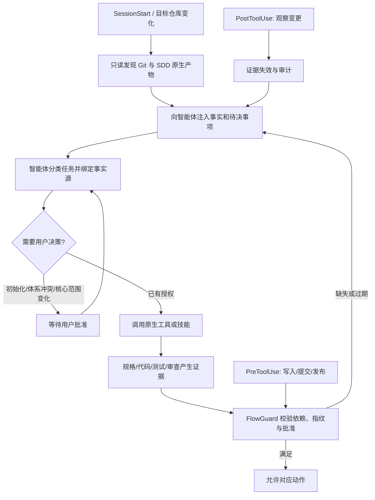

# FlowGuard 智能体驱动 SDD 治理规格

> **历史说明**：本文关于“十阶段仅兼容”和“项目内 `.flowguard/` 治理状态”的决策已由 [十阶段 docs 治理规格](2026-09-23-flowguard-docs-ten-stage-governance.md) 取代；其余发现、任务层级和证据原则仍可参考。

> **文档说明**：定义 FlowGuard 从固定十阶段流水线迁移为智能体驱动 SDD 治理层后的行为契约。
> **版本**：v1.0
> **最后更新**：2026-09-23

## 1. 文档信息

### 1.1 版本记录

| 版本 | 日期 | 变更内容 | 状态 |
|:---|:---|:---|:---|
| v1.0 | 2026-09-23 | 建立原生规格发现、任务绑定、证据和确定性门禁契约 | ✅ 当前规格 |

### 1.2 文档责任人

| 角色 | 责任 |
|:---|:---|
| 产品决策 | 用户确认首次初始化、规格体系冲突、核心范围变化和最终验收 |
| 语义执行 | 智能体理解任务、选择适用流程、拆分子任务并推进原生工具 |
| 治理裁决 | FlowGuard 校验绑定、批准、依赖和证据，并阻止绕过必要流程 |

## 2. 规格地位与范围

本规格取代工作区旧规格 `docs/superpowers/specs/2026-09-22-devflow-plugin-design.md` 中“固定十阶段是默认流程事实源”的设计。旧规格和 `.flowguard/features/*/artifacts` 仅作为兼容与迁移输入，不再是新任务的默认规格来源。

### 2.1 目标

- 检测 Git 项目时，强制智能体完成 SDD 适用性检查，而不是静默跳过。
- 复用 Spec Kit、OpenSpec 或 Superpowers 的原生产物，不复制规格正文。
- 允许智能体根据任务语义推进；FlowGuard 只做可核验的确定性裁决。
- 将上下文绑定到 `会话 + worktree + 变更`，避免全局 `current_feature` 串扰。
- 支持项目、功能、子功能和任务依赖，并按受影响范围使证据失效。
- 消费 CodeGuard、CodeReview 和测试工具产生的证据，但不把机器 PASS 当作用户验收。

### 2.2 非目标

- 不实现 Spec Kit、OpenSpec 或 Superpowers 已有的规格编写和工程方法。
- 不依靠 Hook 或命令字符串判断业务语义、自动推进阶段或自动验收。
- 不在未获批准时初始化、安装、升级或迁移 SDD 工具。
- 不替代 CodeGuard 的静态检查，也不替代 CodeReview 的语义审查。

## 3. 核心原则

1. **智能体判断下一步**：任务分类、规格选择、拆分与推进属于语义决策。
2. **原生产物是规格事实源**：FlowGuard 只保存路径、标识、摘要和指纹。
3. **门禁必须可核验**：批准、依赖、证据、代码指纹和有效期由确定性逻辑检查。
4. **缺失前置条件必须可修复**：拒绝结果必须说明允许操作和下一步命令。
5. **发现不等于初始化**：CLI 存在、技能存在、项目已初始化是三种独立事实。
6. **兼容但不继续扩张旧模型**：十阶段状态机保留读取和迁移能力，新治理模型独立演进。

## 4. 系统架构

### 4.1 组件职责

| 组件 | 当前状态 | 目标职责 |
|:---|:---|:---|
| Discovery | ✅ 已实现 | 发现 Git、项目类型、三类 SDD 标识、CLI 可用性和冲突 |
| Context Store | ✅ 已实现 | 按会话、worktree、变更保存任务分类、事实源、层级和依赖 |
| Evidence Store | ✅ 已实现 | 保存生产者、类型、引用、结果、代码指纹和过期状态；命令只保存哈希 |
| Policy Engine | ✅ 已实现 | 按任务类型和动作检查绑定、批准、依赖与证据 |
| Hooks | ✅ 五类 Hook | 发现、提醒、校验、失效和收尾，不做语义阶段推进 |
| Legacy Adapter | ✅ 已存在 | 只兼容旧 `.flowguard` 状态，提供迁移提示 |

## 5. 发现与选择契约

### 5.1 发现结果

发现命令必须输出：

- 仓库根目录、Git common dir、worktree 根目录；
- Greenfield、Brownfield 或 unknown；无法确定时按 Brownfield；
- `.specify/`、`openspec/`、`docs/superpowers/specs/`、`docs/superpowers/plans/` 是否存在；
- 对应 CLI 是否可执行，且不得据此推断项目已初始化；
- 当前建议的事实源、冲突和必须由用户决定的事项；
- 旧 `.flowguard/project.json` 是否存在以及兼容状态。

### 5.2 选择顺序

事实源按以下顺序决定：用户明确指定 > 项目指令 > 当前变更已有产物 > 仓库持续使用的体系 > 项目与任务默认规则。

当 `.specify/` 与 `openspec/` 同时存在且无法从当前变更判断时，状态为 `choice_required`，不得创建规格或写业务代码；读取、探索、补充决策信息和请求用户选择必须保持可用。

### 5.3 无体系项目

| 任务类型 | FlowGuard 行为 |
|:---|:---|
| `read_only` | 记录分类后允许，不要求初始化 |
| `simple_change` | 允许轻量执行，但要求验证证据 |
| `important_change` | 要求智能体提出适用体系和文件影响，并等待首次初始化批准 |
| `incident` | 允许先恢复稳定；行为变化在恢复后补规格 |

## 6. 任务上下文契约

任务上下文保存在 `.flowguard/contexts/<context-id>.json`，只保存治理元数据，不保存规格正文。

必需字段：`context_id`、`session_id`、`worktree_id`、`task_id`、`task_type`、`spec_system`、`spec_ref`、`status`、`parent_id`、`depends_on`、`required_evidence`、`approvals`、`created_at`、`updated_at`。

约束：

- 同一 `session_id + worktree_id` 只能有一个 active 上下文。
- `spec_ref` 必须位于目标仓库内或是明确的外部只读引用。
- 子任务继承父任务约束，只记录增量；普通实现步骤留在原生 tasks 中。
- 完成父任务前，所有必要子任务和依赖必须收敛，且父级集成验证有效。
- 不再以全局 `current_feature` 作为新治理模型的选择器。

## 7. 证据契约

证据保存在 `.flowguard/evidence/<context-id>/<evidence-id>.json`。

必需字段：`evidence_id`、`context_id`、`kind`、`producer`、`result`、`summary`、`source_ref`、`code_fingerprint`、`created_at`、`expires_on_change`。

支持的首批类型：`spec_verified`、`tests`、`static_analysis`、`semantic_review`、`user_acceptance`、`release_readiness`。

- CodeGuard 的结果只能满足 `static_analysis` 或确定性测试类证据。
- CodeReview 的结果只能满足 `semantic_review`；模型自报 PASS 不能代替验证与用户验收。
- `user_acceptance` 只能由用户明确确认或由用户发起的命令记录。
- 代码指纹变化后，所有 `expires_on_change=true` 且指纹不一致的证据必须视为 stale。

## 8. 动作门禁契约

动作分为：`read`、`spec_write`、`test_write`、`code_write`、`git_commit`、`release`。

| 动作 | 最低条件 |
|:---|:---|
| `read` | 始终允许 |
| `spec_write` | 允许用于解除阻断；体系冲突时仅允许补充决策材料 |
| `test_write` | 已绑定可写上下文；incident 同样需要绑定以保留审计归属 |
| `code_write` | 已分类并绑定；important change 具有有效规格引用和必要批准 |
| `git_commit` | code_write 条件 + 测试 + 静态检查 + 语义审查证据有效 |
| `release` | git_commit 条件 + 发布就绪 + 必要用户验收；无未完成必要子任务 |

拒绝信封必须包含：`code`、`message`、`fix`、`allowed_actions`、`missing`。Hook 自身异常继续 fail-open 并告警，治理状态明确缺失时 fail-closed。

## 9. Hook 契约

| Hook | 职责 | 禁止行为 |
|:---|:---|:---|
| `SessionStart` | 只读发现、恢复上下文、注入 SDD 待办 | 自动初始化或自动选体系 |
| `UserPromptSubmit` | 提醒智能体重新判断任务/范围/上下文 | 仅靠关键词直接改状态 |
| `PreToolUse` | 对写码、提交、发布核验前置条件 | 阻断读取、澄清、补规格和补测试 |
| `PostToolUse` | 收集结果、观察代码变化、使证据过期 | 以命令成功自动推进或验收 |
| `Stop` | 汇总本轮完成度、缺失证据和下一步 | 把会话结束等同任务完成 |

## 10. 兼容与迁移

- `init/feature/next/advance/override` 暂时保留并标记为 `legacy`。
- 新命令为 `discover/context/evidence/governance`；新 Hook 只依赖新治理模型。
- 已存在旧状态但没有新上下文时，SessionStart 必须提示迁移，不得把旧阶段状态自动转换成批准或证据。
- 删除旧模型、移动旧产物或自动迁移状态不属于本版本范围。

## 11. 验收标准

1. Git 项目即使没有 `.flowguard`，SessionStart 也会输出 SDD 发现和待办。
2. `.specify/` 与 `openspec/` 冲突时，important change 的业务写入被阻止，决策材料写入仍可进行。
3. 两个 session 或 worktree 的 active 上下文互不覆盖。
4. important change 未绑定时阻止业务写入；绑定后允许写测试，并在满足规格批准后允许写码。
5. Git commit 必须具备当前代码指纹对应的测试、静态检查和语义审查证据。
6. 代码变化使旧证据 stale，但不删除历史记录。
7. 父任务在必要子任务或依赖未完成时不能发布。
8. Hook 返回的阻断信息包含可执行的恢复路径，且不会封死补规格、补测试或请求批准。
9. 旧十阶段测试保持通过，或有明确的兼容变更说明。

---

**文档版本**：v1.0
**创建日期**：2026-09-23
**最后更新**：2026-09-23
**文档状态**：✅ 已实现并验证
